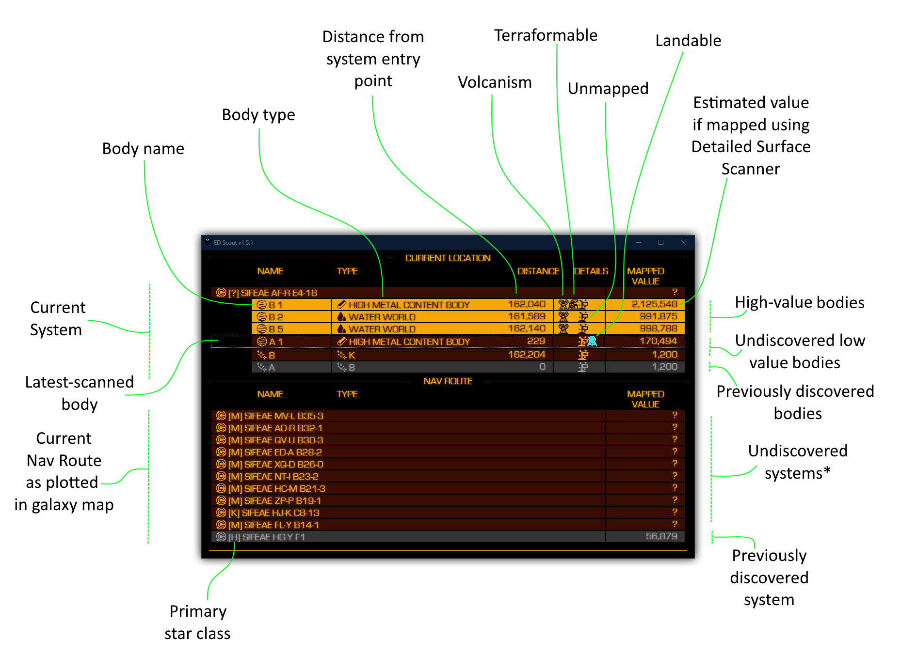
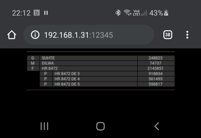

# Elite Dangerous Scout

Greetings commander and welcome to EDScout; an Elite Dangerous companion app to simplify finding unexplored worlds.

I got sick of jumping into system after system trying to find unexplored worlds to put my name to only to be disappointed because someone had already explored it. This tool is intended to help improve your odds of finding new and interesting systems and worlds to explore.

Note that many systems out there have already been discovered by commanders who weren't running EDDiscovery / EDSM. Consequently there's no guarantee that the system you're about to leap into is _definitely_ new, but it certainly improves the chances. Conversely, if you're looking for guarantees that systems you're jumping to will make some money with a bit of scanning, this _will_ quickly show you some profitable route options (along the lines of the road to riches but with less typing).

Enjoy this tool? Consider [donating to EDSM](https://www.edsm.net/en_GB/donation) so the scout can keep flying :-) 

## Usage
 
1. If you don't already have it, install [Google Chrome browser](https://www.google.com/intl/en_uk/chrome/)
1. Download [the latest release of ED Scout](https://github.com/joncage/ed-scout/releases/latest)
1. Run `EDScout.exe`
1. Plot a new route in Galaxy Map and watch EDScout work it's magic; Scouting out which systems in your route have already been explored and how much mapping them is worth.

\* Note: The refers to whether EDSM knew about the system. There are plent of systems out there which have been discoverd by console players and PC players not running EDDiscovery etc.

## Command line options

If you want to make the web UI available to other devices on your network, you can specify a host (set this to [the IP address](https://www.google.com/search?q=how+to+find+the+ip+address+of+a+windows+computer) of the machine running EDSCout) and port as follows:

`EDScout.exe -port 12345 -host 192.168.1.31`

Assuming your computer's firewall allows it, you should then be able to access it from other devices on the local network. For example here it is displaying on my mobile:

## Troubleshooting

* No GUI appears.
  * Check you have Chrome installed.
  * Check the logs in `C:\Users\<YOUR USER NAME>\AppData\Local\EDScout\Logs\EDScout-YYYY-MM-DD-HH-MM-SS.log` for clues.
* Multiple entries appear in task manager.
  * This is  normal (due to the architecture of the software) and is down to the fact we have a Python back end doing the hard work and a chrome instance displaying the results.
* When I launch multiple copies, the second one crashes.
  * This is due to the way a background watcher looks for changes in the navroute files and (via a local network link) hands over the data to the web service. Don't run more than one copy and it'll work fine :-)

## Version History

### 1.5.3 - Fixed detection of relocated saved-games folder.

* Fixed detection of the Saved Games folder in case a user as moved it to another folder / drive.
* Fixed a minor bug in the installer code that stopped auto-detection of the version from a clean repo (no commits after the version tag).

### 1.5.1 - Fixed bad packaging of 1.5.0

* Fixed an oversight where PyInstaller was once again failing to spot a dynamicalyl loaded dependency.

### 1.5.0 - Focus hotkey, better sorting, minor fixes

* Added hotkey (START+Z) to put the scout aobe or hide it behind elite.
* Fixed going to the galaxy map wiping out the bodies scanned in the current system.
* Added sorting so that valuable systems stick to the top of the list.
* Removed the scroll-to-latest-entry bit that was added to 1.4

### 1.4.0 - Titles, Load on startup, Cleaner / more complete icons

* Added loading of current position / nav route on startup.
* Cleaned up the GUI a bit to combine some columns of related info.
* Fixed the terraformable / volcanism / lander flags so they work for all discovery / valuebale-system highlighting.
* Changed the flagging so icons for flags like volcanism only show up when they're active (instead of showing as a misleading black background.
* Fixed (I think!) the file-prompter hookup which encourages Windows to flus ht changes to journal files.
* Added title to highlight what's in each column.
* Added missing icons for some of the celestial bodies & replaced some with some I think are cleaner.

### 1.3.0 - Icontastic, live scan results & clearer info

* Added live-scan results that mimics the calculations EDSM makes to identify worth of scanning a world.
* Added icons showing volcanism, terraformability, landability and whether a planet has been mapped before.
* Added distance from landing point.
* Added highlighting of undiscovered vs unmapped etc

### 1.2.5 - More Hud customisation resiliance & Chrome location detection

* Fixes handling for HUD .xml files that don't have an entry for every matrix value (some third party tools don't specify all of them and Elite is fine with that so the scout should be too).
* Added more thorough detection of the chrome browser (fix to third party PyWebGui library).

### 1.2.4 - Crash fix

* Fixed a crash that occurred when you jump into a system which was unknown to EDSM (and consequently unable to feed back the star type).

### 1.2.3 - Stability, Logging & More info logged 

* Fixed journal updates not being detected on some machines.
* Moved logging to `C:\Users\User\AppData\Local\EDScout\Logs`
* Tidied up some unnecessary logging.
* Added logging of additional information from EDSM in prep for the next release.

### 1.2.0 - HUD Colours & Better Journal Support

* Added detection of the user's HUD colours from the override file `C:\Users\<User>\AppData\Local\Frontier Developments\Elite Dangerous\Options\Graphics\GraphicsConfigurationOverride.xml`.
* Added colour adjustment to match the HUD colours.
* Better journal support to present the next-selected target system at the top of the nav route list.

### 1.1.0 - More options

* Added commandline options to set port and host to enable external devices to connect to the UI.
* Fixed a crash when multiple instances are opened.

### 1.0.0 - Initial release

* Written in Python.
* Basic GUI  is operational using a combination of Flask, ZMQ and SocketIO.
* Watches `C:\Users\<USER>\Saved Games\Frontier Developments\Elite Dangerous\NavRoute.json` for changes then queries EDSM for all the systems in the route to check their value.
* Packaged up using PyInstaller. 
